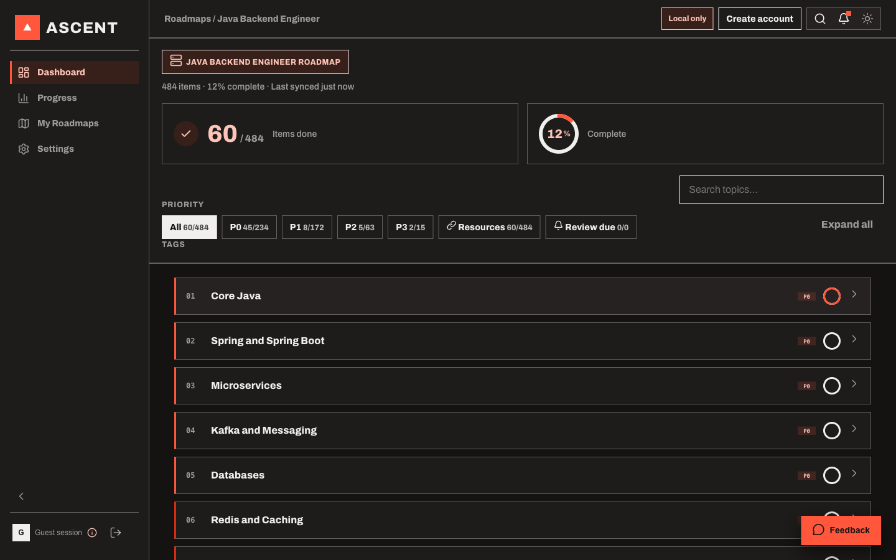
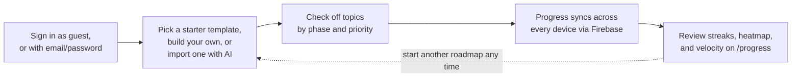
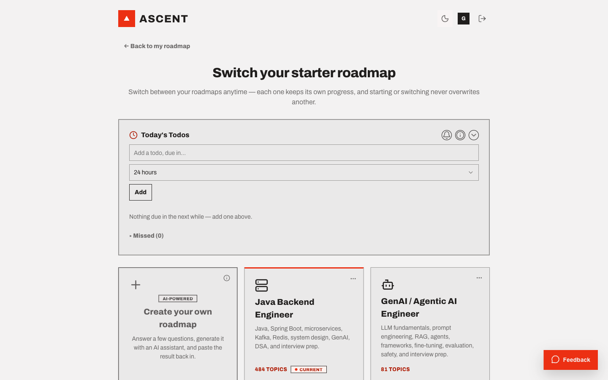
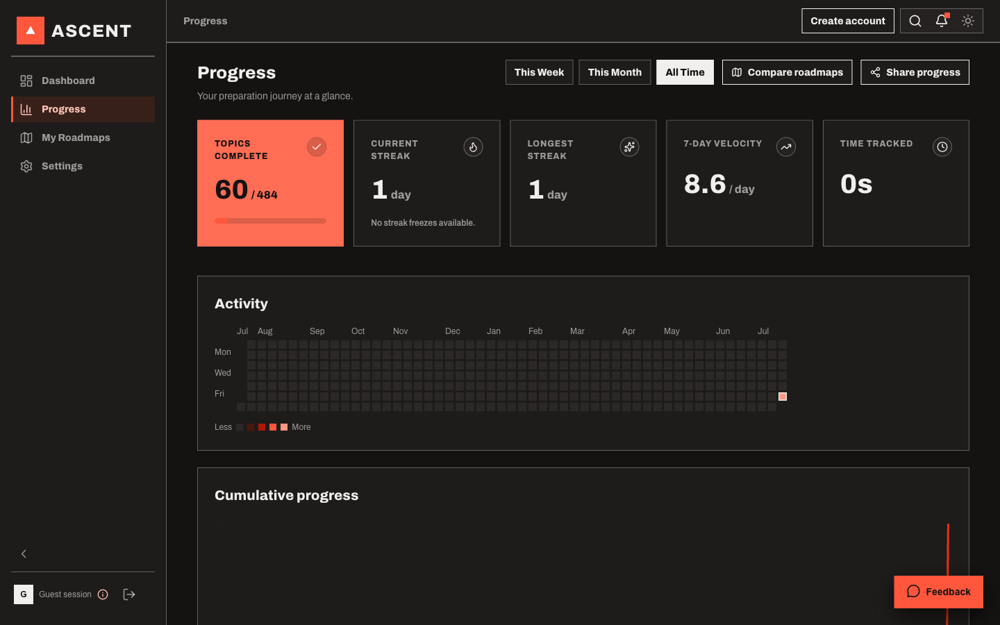
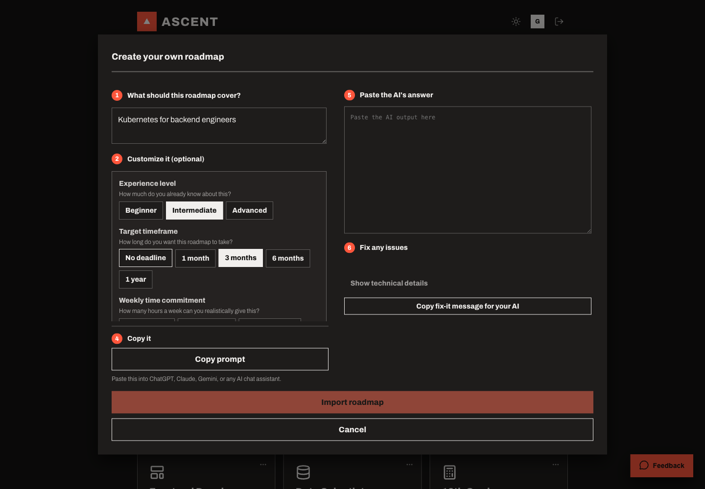
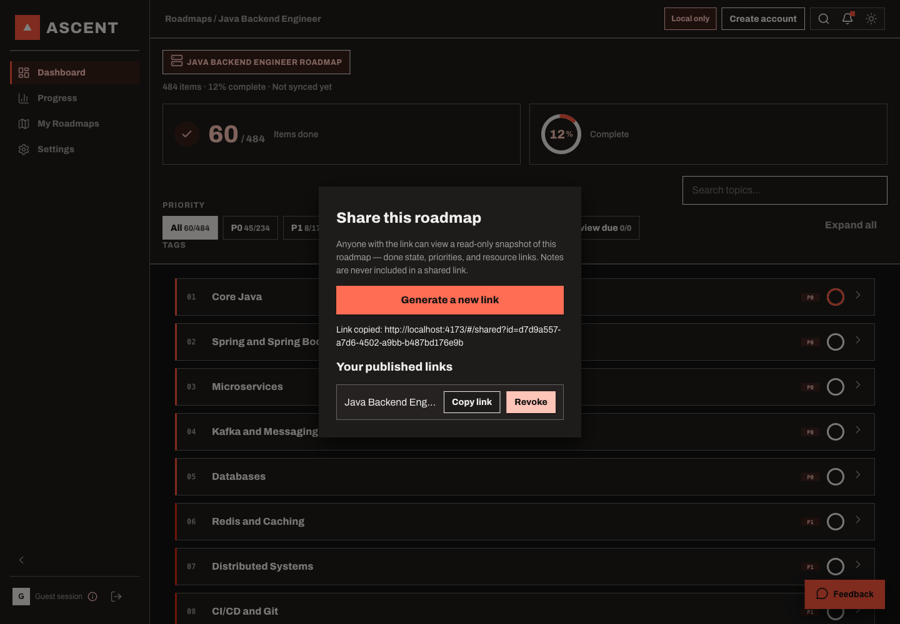
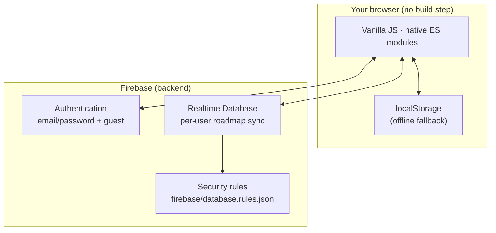

<p align="center">
  
</p>

<h1 align="center">Ascent</h1>
<p align="center"><strong>Engineer your next move.</strong></p>

<p align="center">
  A personal roadmap tracker for anyone learning, revising, or working toward a goal —
  students, professionals, and career switchers alike. No account required to try it,
  no build step required to run it.
</p>

<p align="center">
  
  
  
  
  <br>
  
  
  
</p>

<p align="center">
  
</p>

<p align="center">
  <a href="#what-it-is">What it is</a> ·
  <a href="#how-it-works">How it works</a> ·
  <a href="#features">Features</a> ·
  <a href="#architecture-at-a-glance">Architecture</a> ·
  <a href="#getting-started">Getting started</a> ·
  <a href="#contributing">Contributing</a> ·
  <a href="#project-status">Project status</a>
</p>

---

## What it is

New sign-ups pick a starter template and get an editable, syncable checklist —
organized into phases and sections, each topic carrying its own resource links,
priority, and notes — instead of a wiki page or a spreadsheet that goes stale.

| Template | Focus |
|---|---|
| **Java Backend Engineer** | Java, Spring Boot, microservices, system design |
| **GenAI / Agentic AI Engineer** | LLMs, agent frameworks, RAG, prompt engineering |
| **Frontend Developer** | HTML/CSS/JS, frameworks, accessibility, performance |
| **Data Scientist** | Statistics, ML, Python tooling, model deployment |
| **12th Grade Mathematics** | Exam-focused syllabus tracker |
| **Learning Piano** | Structured practice roadmap |
| **Marketing** | Growth, content, analytics fundamentals |

Not a fit? **Create your own roadmap** — answer a few questions, generate one with
your AI assistant of choice, and paste the result back in; it's validated and
imported automatically, phases/sections/priorities and all.

Any starter template can be hidden from your own picker without affecting anyone
else's account, and you can run more than one roadmap at a time — switching between
them never overwrites another's progress.

## How it works



No tutorial required — the flow above is the entire learning curve. If you're not
sure where to start, "Continue as guest" needs no signup and gets you to a real
roadmap in one click.

## Features

- **Sign in with email/password, or start instantly as a guest** — no signup wall
  between you and your first roadmap.
- **Cross-device sync via Firebase**, with a `localStorage` offline fallback so the
  app still works with no connection.
- **Progress analytics** — completion streaks, a GitHub-style activity heatmap,
  7-day velocity, and a cumulative-progress projection chart.
- **Daily Todos** — pull specific topics into a lightweight daily list with optional
  reminders, linked back to their source roadmap topic.
- **AI-assisted roadmap import** — paste a generated roadmap from your assistant of
  choice and it's validated and imported automatically.
- **Share a read-only snapshot** of your roadmap or progress via a public link, or
  export a branded PDF/print view.
- **First-time guided tour**, a command palette (`Cmd/Ctrl+K`), and full light/dark
  theming that follows your system preference by default.
- **Installable as a PWA** with offline support.

<p align="center">
  
  
  
  
</p>

## Architecture at a glance

No build step, no framework, no server you have to run — the browser talks
directly to Firebase, with `localStorage` picking up the slack when there's no
connection. See [`docs/architecture.md`](docs/architecture.md) for the full
breakdown; this is the 30-second version.



Vanilla JavaScript over native ES modules — **no build step, no bundler, no
framework.** Vitest for unit/integration tests, Playwright for E2E. See
[`docs/architecture.md`](docs/architecture.md) for the full data model and file
layout, and [`CLAUDE.md`](CLAUDE.md) / [`AGENTS.md`](AGENTS.md) for the conventions
this codebase follows.

## Getting started

You don't need to be a developer to use Ascent — signing in as a guest on the
deployed app is the fastest path, no install required. The steps below are only
for running your **own local copy** (useful for development, or for self-hosting).

<details open>
<summary><strong>Prerequisites</strong> (click to expand/collapse)</summary>
<br>

You'll need three things installed, all free:

| Tool | What it's for | Get it |
|---|---|---|
| **Git** | downloads ("clones") the code to your computer | [git-scm.com/downloads](https://git-scm.com/downloads) |
| **Node.js** (v20 or later) | runs the dev server and test suite — this project has *no build step*, Node is only the runner | [nodejs.org](https://nodejs.org) (installing Node also installs `npm`, used below) |
| **A free Firebase project** | the backend for sign-in and syncing roadmaps | [console.firebase.google.com](https://console.firebase.google.com) — walked through in step 2 below |

New to the command line? "Clone" just means "download a copy of this repository
to your computer," and every code block below is something you paste into a
terminal (macOS: Terminal app; Windows: PowerShell; Linux: your shell of choice)
and press Enter on.
</details>

1. **Clone and install** — there are no dependencies to install; this is a static
   site.
   ```bash
   git clone https://github.com/adv11/ascent.git
   cd ascent
   ```
2. **Set up Firebase.** Create a project at [console.firebase.google.com](https://console.firebase.google.com),
   then copy the example config to a real one:
   - macOS/Linux:
     ```bash
     cp src/services/firebase.config.example.js src/services/firebase.config.js
     ```
   - Windows (PowerShell):
     ```powershell
     Copy-Item src/services/firebase.config.example.js src/services/firebase.config.js
     ```
   Fill in `firebase.config.js` with your project's values (Project settings →
   General → Your apps). This file is gitignored — it's meant to hold your own
   credentials, never a committed value.
   - Enable **Email/Password** and **Anonymous** sign-in under Authentication.
   - Publish the Realtime Database rules from `firebase/database.rules.json`.
3. **Run it.**
   ```bash
   npm run dev
   ```
   Serves the app at `http://localhost:4173` on macOS, Linux, and Windows alike —
   `npm run dev` shells out to a small Node-only static server
   (`scripts/dev-server.mjs`), so no separate Python install or OS-specific command is
   needed.

<details>
<summary><strong>Something not working?</strong> Common first-run issues</summary>
<br>

- **"command not found: git" or "npm"** — the corresponding tool from the
  Prerequisites table above isn't installed yet, or your terminal needs restarting
  after installing it.
- **Sign-in fails / spins forever** — double-check Email/Password and Anonymous
  sign-in are both enabled in the Firebase console (step 2), and that
  `firebase.config.js` was filled in with your project's real values, not left as
  the example placeholders.
- **Blank page / console errors about `firebase.config.js`** — this file is
  gitignored on purpose; make sure you actually copied the example file (step 2)
  rather than assuming it exists.
- **Still stuck?** Open a [GitHub issue](../../issues/new/choose) — see
  "Contributing" below.
</details>

## Contributing

You don't have to write code to contribute:

- **Found a bug or have an idea?** Open a [GitHub issue](../../issues/new/choose) —
  no local setup needed. If you're using the deployed app, the in-app feedback
  widget (floating button, bottom corner) captures a screenshot for you
  automatically.
- **Spot unclear or outdated docs?** Docs fixes are just as welcome as code —
  small wording/README PRs are a great first contribution.
- **Want to write code?** Follow [Getting started](#getting-started) above, then:
  1. Read [`CLAUDE.md`](CLAUDE.md) — DOM construction, brand rules, store
     contracts, styling, and security conventions this codebase follows.
  2. Branch off `main`: `feat/`, `fix/`, `refactor/`, `docs/`, or `chore/` followed
     by a short slug (e.g. `fix/dropdown-select-overlay-scrim`).
  3. Before opening a PR:
     ```bash
     npm run lint     # must exit 0
     npm test         # must exit 0
     ```
  4. Reference the issue you're addressing in your PR description — see
     [`.github/PULL_REQUEST_TEMPLATE.md`](.github/PULL_REQUEST_TEMPLATE.md).

Full details — code conventions, commit style, the Lighthouse perf check — live in
[`CONTRIBUTING.md`](CONTRIBUTING.md).

<p align="center">
  <a href="https://github.com/adv11/ascent/graphs/contributors">
    
  </a>
</p>

## Project status

Feature-complete through Step 7 of the build-out; Step 8 (Launch) is in its final
stretch. [Issue #11](https://github.com/adv11/ascent/issues/11) is the single
source of truth for current status — see it for the full, up-to-date list of what's
left. See [`CHANGELOG.md`](CHANGELOG.md) for the detailed change history and
[`docs/roadmap.md`](docs/roadmap.md) for a pointer to the same tracker.

Tests run via `npm test` (Vitest unit + integration, 1358 tests) and `npm run test:e2e`
(Playwright). Run `npm run lint` to check for security and quality issues. See the
"Verifying changes" section of [`CLAUDE.md`](CLAUDE.md) for the full checklist.

## Deploying

```bash
firebase deploy            # deploys hosting + database rules
firebase deploy --only hosting
```

Every push to `main` auto-deploys to Firebase Hosting via GitHub Actions. Every PR
gets a temporary preview URL posted as a comment. See [`docs/architecture.md`](docs/architecture.md)
for the required GitHub secrets (`FIREBASE_SERVICE_ACCOUNT`, `FIREBASE_CONFIG`,
`FIREBASE_PROJECT_ID`).

> **Note on `firebase.config.js`:** The values in this file (`apiKey`, `authDomain`,
> etc.) are public client identifiers — they are embedded in the page JavaScript and
> visible to any user who opens DevTools. Firebase's security model relies on Security
> Rules, not on keeping these values private. The file is gitignored to avoid committing
> production credentials during local development; CI injects it from a GitHub Secret.

## License

All rights reserved — see [`LICENSE`](LICENSE). This code is shared for viewing
only; no license to use, copy, or modify is granted without permission.

---

<p align="center">
  <sub>Repository activity, for the curious:</sub><br>
  <a href="https://star-history.com/#adv11/ascent&Date">
    
  </a>
</p>
