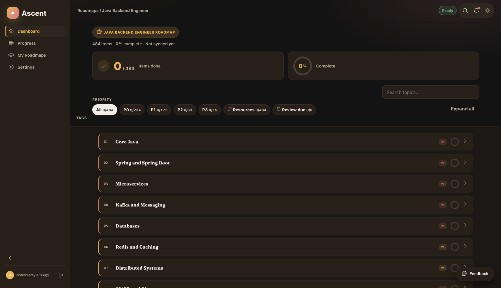
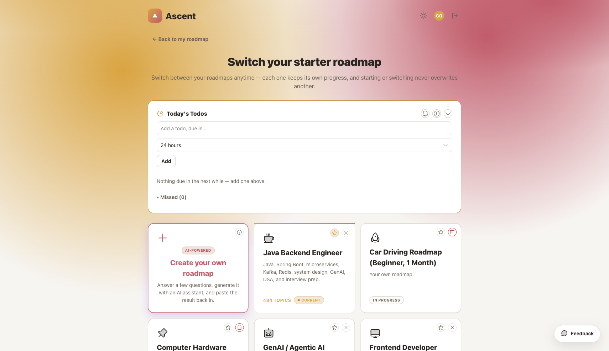
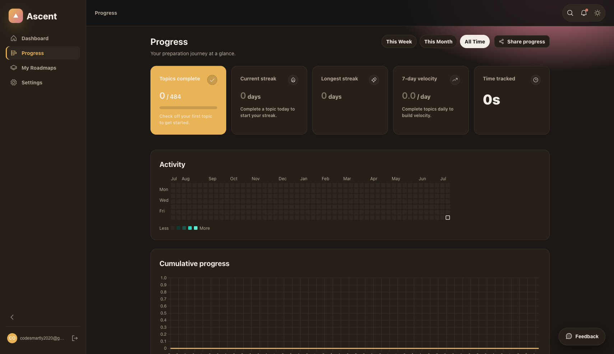

<p align="center">
  
</p>

<h1 align="center">Ascent</h1>
<p align="center"><strong>Engineer your next move.</strong></p>

<p align="center">
  A personal roadmap tracker for anyone learning, revising, or working toward a goal —
  students, professionals, and career switchers alike.
</p>

<p align="center">
  
  
  
  
</p>

<p align="center">
  
</p>

---

## What it is

New sign-ups pick a starter template and get an editable, syncable checklist —
organized into phases and sections, each topic carrying its own resource links,
priority, and notes — instead of a wiki page or a spreadsheet that goes stale.

| Template | Focus |
|---|---|
| **Java Backend Engineer** | Java, Spring Boot, microservices, system design |
| **GenAI / Agentic AI Engineer** | LLMs, agent frameworks, RAG, prompt engineering |
| **Frontend Developer** | HTML/CSS/JS, frameworks, accessibility, performance |
| **Data Scientist** | Statistics, ML, Python tooling, model deployment |
| **12th Grade Mathematics** | Exam-focused syllabus tracker |
| **Learning Piano** | Structured practice roadmap |
| **Marketing** | Growth, content, analytics fundamentals |
| **Blank slate** | Build your own from scratch, or generate one with AI import |

Any template except the blank one can be hidden from your own picker without
affecting anyone else's account, and you can run more than one roadmap at a time —
switching between them never overwrites another's progress.

## Features

- **Sign in with email/password, or start instantly as a guest** — no signup wall
  between you and your first roadmap.
- **Cross-device sync via Firebase**, with a `localStorage` offline fallback so the
  app still works with no connection.
- **Progress analytics** — completion streaks, a GitHub-style activity heatmap,
  7-day velocity, and a cumulative-progress projection chart.
- **Daily Todos** — pull specific topics into a lightweight daily list with optional
  reminders, linked back to their source roadmap topic.
- **AI-assisted roadmap import** — paste a generated roadmap from your assistant of
  choice and it's validated and imported automatically.
- **Share a read-only snapshot** of your roadmap or progress via a public link, or
  export a branded PDF/print view.
- **First-time guided tour**, a command palette (`Cmd/Ctrl+K`), and full light/dark
  theming that follows your system preference by default.
- **Installable as a PWA** with offline support.

<p align="center">
  
  
</p>

## Tech stack

Vanilla JavaScript over native ES modules — **no build step, no bundler, no
framework.** Firebase Authentication + Realtime Database for sync, with
`localStorage` as an offline fallback. Vitest for unit/integration tests, Playwright
for E2E.

See [`docs/architecture.md`](docs/architecture.md) for the full data model and file
layout, and [`CLAUDE.md`](CLAUDE.md) / [`AGENTS.md`](AGENTS.md) for the conventions
this codebase follows.

## Getting started

1. **Clone and install** — there are no dependencies to install; this is a static
   site.
   ```bash
   git clone https://github.com/adv11/ascent.git
   cd ascent
   ```
2. **Set up Firebase.** Create a project at [console.firebase.google.com](https://console.firebase.google.com),
   then copy the example config to a real one:
   - macOS/Linux:
     ```bash
     cp src/services/firebase.config.example.js src/services/firebase.config.js
     ```
   - Windows (PowerShell):
     ```powershell
     Copy-Item src/services/firebase.config.example.js src/services/firebase.config.js
     ```
   Fill in `firebase.config.js` with your project's values (Project settings →
   General → Your apps). This file is gitignored — it's meant to hold your own
   credentials, never a committed value.
   - Enable **Email/Password** and **Anonymous** sign-in under Authentication.
   - Publish the Realtime Database rules from `firebase/database.rules.json`.
3. **Run it.**
   ```bash
   npm run dev
   ```
   Serves the app at `http://localhost:4173` on macOS, Linux, and Windows alike —
   `npm run dev` shells out to a small Node-only static server
   (`scripts/dev-server.mjs`), so no separate Python install or OS-specific command is
   needed.

## Deploying

```bash
firebase deploy            # deploys hosting + database rules
firebase deploy --only hosting
```

Every push to `main` auto-deploys to Firebase Hosting via GitHub Actions. Every PR
gets a temporary preview URL posted as a comment. See [`docs/architecture.md`](docs/architecture.md)
for the required GitHub secrets (`FIREBASE_SERVICE_ACCOUNT`, `FIREBASE_CONFIG`,
`FIREBASE_PROJECT_ID`).

> **Note on `firebase.config.js`:** The values in this file (`apiKey`, `authDomain`,
> etc.) are public client identifiers — they are embedded in the page JavaScript and
> visible to any user who opens DevTools. Firebase's security model relies on Security
> Rules, not on keeping these values private. The file is gitignored to avoid committing
> production credentials during local development; CI injects it from a GitHub Secret.

## Project status

Feature-complete through Step 7 of the build-out; Step 8 (Launch) is in its final
stretch. [Issue #11](https://github.com/adv11/ascent/issues/11) is the single
source of truth for current status — see it for the full, up-to-date list of what's
left. See [`CHANGELOG.md`](CHANGELOG.md) for the detailed change history and
[`docs/roadmap.md`](docs/roadmap.md) for a pointer to the same tracker.

Tests run via `npm test` (Vitest unit + integration, 1228 tests) and `npm run test:e2e`
(Playwright). Run `npm run lint` to check for security and quality issues. See the
"Verifying changes" section of [`CLAUDE.md`](CLAUDE.md) for the full checklist.

## Contributing

Found a bug or want to suggest a feature? See [`CONTRIBUTING.md`](CONTRIBUTING.md) for
local setup, code conventions, and how to report issues.

## License

All rights reserved — see [`LICENSE`](LICENSE). This code is shared for viewing
only; no license to use, copy, or modify is granted without permission.
